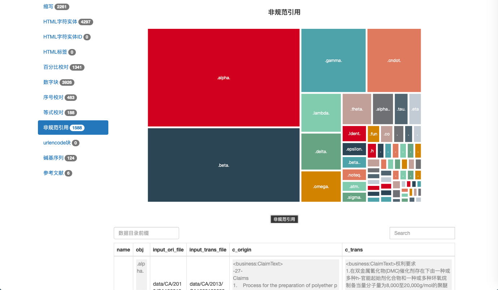
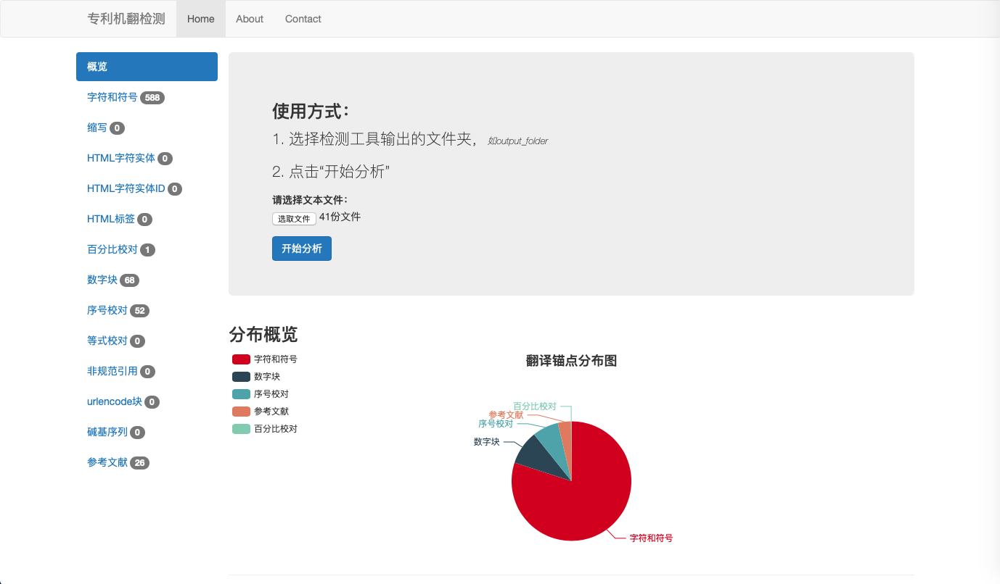

# 专利机翻检测工具
专利机翻检测工具，用于辅助发现机翻中的疑似问题，方便进一步处理。
[线上地址](https://github.com/xiabo0816/PatTransErrorDetect)
# 技术流程
* 定义翻译锚点；
* 原文筛选锚点；
* 译文对照锚点；
* 统计排序；

# 锚点选择方案
1. 对照编码表，定义标准原文字符集，再对字符集取反；
2. 归纳总结，数字、尖括号、标点符号、大写字母、实体词典、专名
3. 对照符号串，在*原文*和*译文*中对这些锚点符号串进行对照；
4. 如果未对照出现，则认为有错误

# 操作流程

*检测工具*和*可视化工具*松耦合，适合多种分析和和任务模式

操作流程分为两部分，
* 利用*检测工具*生成检测结果数据，*.anchors.json
* 利用*可视化工具*views/index.html进行分析

## 检测工具

`run.py`使用python构建，如果缺少安装包，运行前需要pip install缺少的包

```bash
optional arguments:
  -h, --help            show this help message and exit
  -i INPUT_LIST, --input_list INPUT_LIST
                        input_list
  -o OUTPUT_FILE, --output_file OUTPUT_FILE
                        output_file
  -c CONFIG, --config CONFIG
                        config.ini
```
使用流程如下：

1. 准备待分析的原文XML和译文XML
2. 生成原文list，可以使用一些linux命令生成，或者手动构建也可以
3. 检查config.ini文件

接下来详细说一下输入和输出

### `input.list`

这个文件比较简单，由待分析原文的文件列表组成。

生成原文文件列表可以使用
```bash
du -a data/ | awk '{print $2}' | grep -E [A-Z0-9].XML
```

译文文件同时需要放在相同数据目录下，

译文和原文的文件的对应方式是，
译文的文件名字是在原文文件名的基础上，在`.XML`之前拼接`_trans`作为译文的名字，比如：
```bash
data/JP/2014/JP102014000263706JP00020161241010AFULJA20160711JP005.XML
# 该文件的译文路径为：
# data/JP/2014/JP102014000263706JP00020161241010AFULJA20160711JP005_trans.XML
```

### `config.ini`

包含了一些基本设置，DEFAULT是必填的。

剩下的选项是设置翻译锚点，主要是锚点正则表达式们，格式如下：

```ini
[名称]
mode=匹配方式
stat=统计方式
```

示例：

```ini
[HTML字符实体]
__pattern__html_entities_chunk=(&[\w;]+;)
mode=chunk
stat=poly
```
该示例中，设置了名字为“HTML字符实体”的翻译锚点，有一个匹配规则，匹配模式是chunk，统计方式是poly

匹配模式一共有三种：`single`, `chunk`, `multichunk`：

* `single`是指单独匹配，适用于单个字符形式，比如特殊数学符号
* `chunk`是指块匹配，适用于多个字符的字符串形式，比如html实体名称：`&amp;`
* `multichunk`是指多块匹配，适用于复杂的字符串形式。有些复杂规则不能简单通过某一条规则指定，需要多条规则前后叠加，则使用这种匹配方式。比如参考文献


### 输出文件

输出文件是json结构：
* 最外层是map，包括`stat`和`detail`两个
* `stat`是用来可视化树图的数据

1. stat[].name，翻译锚点的名称
2. stat[].path，翻译锚点的名称
3. stat[].value，翻译锚点的名称
4. stat[].chidren，翻译锚点的名称

* `detail`是用来列表展示详情的数据

1. detail[].name 翻译锚点的名称
2. detail[].mode 翻译锚点识别模式
3. detail[].stat 翻译锚点统计模式
4. detail[].obj 具体的识别检测结果
5. detail[].input_ori_file 原文文件名称
6. detail[].input_trans_file 译文文件名称
7. detail[].c_origin 原文预览
8. detail[].c_trans 译文预览

下面是json文件的示例：

```json
{
    "stat": [
        {
            "name": "字符和符号",
            "path": "/字符和符号",
            "value": 588,
            "children": [
                {
                    "name": "【",
                    "path": "/字符和符号/【",
                    "value": 169
                },
            ]
        },
    ],
    "detail": [
        {
            "name": "字符和符号",
            "mode": "mark",
            "stat": "poly",
            "obj": "【",
            "input_ori_file": "data/JP/2014/JP102014000263706JP00020161241010AFULJA20160711JP005.XML",
            "input_trans_file": "data/JP/2014/JP102014000263706JP00020161241010AFULJA20160711JP005_trans.XML",
            "c_origin": "<base:Paragraphs>【課題】  軸筒の前方に配",
            "c_trans": "<base:Paragraphs>已知有在配设于轴筒的前方且"
        }
    ]
```


## 可视化工具

* 使用方式：
1. 选择检测工具输出的文件，如output_file.anchors.json
2. 点击“开始分析”

* 在树图分析的部分，用户可以直接点击树图，表格中将实时展示详细内容

* 用户也可以直接在表格的搜索框中进行检索，查看结果

* 点击原文和译文链接可以直接跳转查看原文




