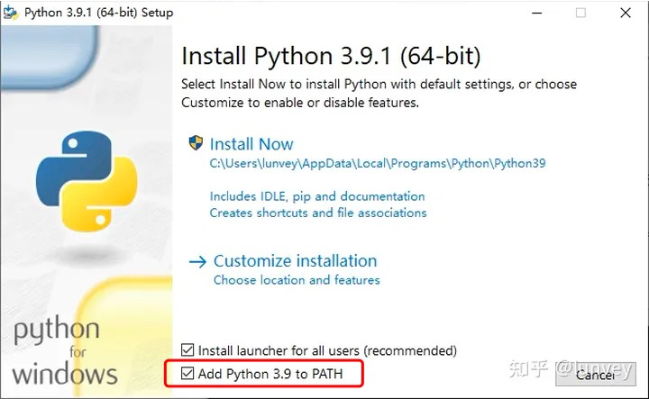
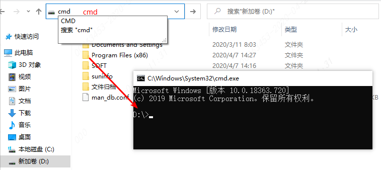

# 专利机翻检测工具 - 常见问题

## 1. 安装完python后，检测版本时仍然提示"不是内部命令"

这种情况下，可以关掉cmd再重新打开一次，之后再试一试。

如果还是不可以，需要卸载重新安装python

并且再次进入安装界面的时候，需要选择这个Add Python to PATH



## 2. 安装时，提示`No module named '...'`

如果缺少的模块，继续使用pip install进行安装：

```
pip install <缺少的模块名>
或
pip3 install <缺少的模块名>
```

pip是python的包管理程序，就是为了安装python包的

比如regex和lxml都是python包，用来完成一些任务，里面有功能可以调用

此外，如果安装包不成功，可以试这个pip的更新命令
```
python -m pip install --upgrade pip
```

## 3. 命令`python run.py ...`应该是在哪个界面执行？

该命令的含义是，使用python解释器运行cmd当前目录的run.py文件

cmd有“当前目录”的概念，run.py需要在“当前目录”下，因此要把cmd切换到run.py所在的目录，切换方法是：

```
在资源管理器的地址栏直接写cmd
```



这样打开可以避免使用cd命令，比较方便


## 4. 可视化工具中表格里的`搜索功能`怎么用？

搜索的是字段内容，

是直接输入需要搜索的内容就可以，在下面的每一个字段内搜索。

这些表格内容里的数字和文字都可以。

## 5. 可视化工具中表格里的`数据目录前缀`该如何设置？

数据目录就是，这个index.html相对于数据的位置，使用目录结构来表示，

比如，folder_name/data和folder_name/views，那么在这里就输入`../`

`..`的含义是相对于当前目录的上级目录

输入之后，程序会把<数据目录前缀>和<input_folder/xxx.xml>拼在一起，变成

```
../input_folder/xxx.xml
```

到这个地址去找xml


## 什么是人工智能技术？咱们的翻译锚点识别，可以称为人工智能技术吗？

人工智能，通俗来说是指让机器像人一样做决策，所以概念很广，

实现方法上，一般可以分为规则系统和统计模型两类

翻译锚点采用规则的方法来弥补统计模型的不足，不需要标注数据、可解释性强。

也就是说，翻译锚点识别可以称为人工智能技术的应用