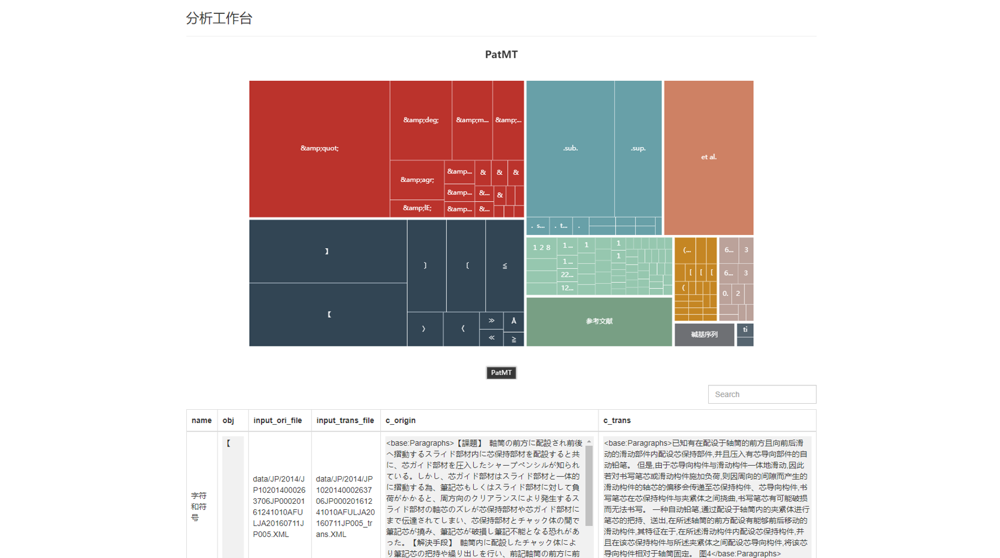
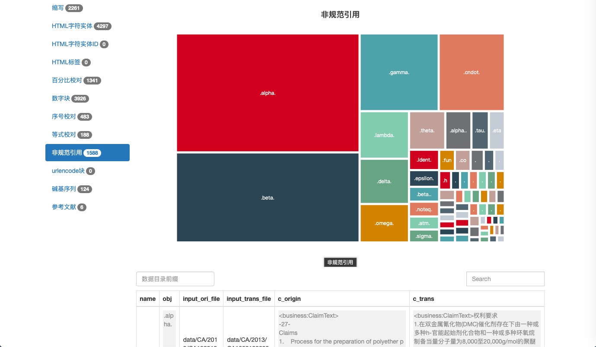

# 专利机翻检测工具 - 使用文档

专利机翻检测工具，用于辅助发现机翻中的疑似问题，方便进一步处理。

[线上地址](https://github.com/xiabo0816/PatTransErrorDetect)

包括*检测工具*和*可视化工具*两部分，
* 检测工具需要做安装配置，用于生成待分析的*.json文件
* 可视化工具不需要，仅需拷贝views/目录、待分析的*.json文件

# 操作流程

*检测工具*和*可视化工具*松耦合，适合多种分析和和任务模式

操作流程分为两部分，
* 利用*检测工具*生成检测结果数据，包括三种：
1. *_visual/文件夹，是用来可视化分析的数据；
2. *_csv文件夹，生成可以使用excel打开的数据；
3. *_errors.txt，生成处理错误的日志数据；
* 利用*可视化工具*views/index.html进行分析

## 检测工具

`run.py`使用python构建，如果缺少安装包，运行前需要pip install缺少的包

使用流程如下：

1. 准备待分析的原文XML和译文XML
2. 将待分析的原文XML和译文XML放在同一个文件夹下，比如input_folder/
3. 检查和配置config.ini文件
4. 利用如下命令进行分析:
```bash
# 运行后，将在同级目录下，生成*_visual/文件夹、*_csv文件夹、*_errors.txt
python run.py -i input_folder/ -o output_folder/ -c config.ini
```

全部的参数列表是：
```bash
usage: run.py [-h] [-i INPUT_FOLDER] [-o OUTPUT_FOLDER] [-c CONFIG] [-j JOBS]

Data process tool.

optional arguments:
  -h, --help            show this help message and exit
  -i INPUT_FOLDER, --input_folder INPUT_FOLDER
                        输入文件夹名
  -o OUTPUT_FOLDER, --output_folder OUTPUT_FOLDER
                        输出文件夹名称前缀
  -c CONFIG, --config CONFIG
                        配置文件
  -j JOBS, --jobs JOBS  进程数，一般默认即可
```

接下来详细说一下输入和输出

### `input.folder`

这个文件夹存放了原文XML和译文XML，也就是原文和译文文件同时需要放在相同目录下。

run.py将从文件夹中找到原文XML，并对应找到译文。

原文和译文的对应方式是：

译文的文件名字是在原文文件名的基础上，在`.XML`之前拼接`_trans`作为译文的名字，比如：
```bash
data/JP/2014/JP102014000263706JP00020161241010AFULJA20160711JP005.XML
# 该文件的译文路径为：
# data/JP/2014/JP102014000263706JP00020161241010AFULJA20160711JP005_trans.XML

# 示例操作命令：
python run.py -c config.ini -i data/JP -o output_jp/
```

### 配置文件说明

`config.ini`包含了一些基本设置，其中，DEFAULT是必填的。

#### DEFAULT配置项

1. `TAG`: 用于指定需要匹配的XML标签

2. `MAX_ERROR_TIMES_PERTAG_PERTYPE`: 在可视化中输出的每个类型的错误数，默认是10

3. `MAX_ERROR_TIMES_PERTAG_PERTYPE_CSV`: 在csv中输出的每个类型的错误数，默认是100

4. `MAX_LENGTH_PERTAG`: 标签内容的最大长度，默认是10240，就是说每个标签下最多有一万字

5. `FILE_NAME_PATTERN`: 原文XML的文件名形式，一般不需要修改

#### 锚点正则配置项

剩下的选项是设置翻译锚点，主要是锚点正则表达式们，格式如下：

```ini
[名称]
mode=匹配方式
stat=统计方式
```

示例：

```ini
[HTML字符实体]
__pattern__html_entities_chunk=(&[\w;]+;)
mode=chunk
stat=poly
```
该示例中，设置了名字为“HTML字符实体”的翻译锚点，有一个匹配规则，匹配模式是chunk，统计方式是poly

匹配模式一共有三种：`single`, `chunk`, `multichunk`：

* `single`是指单独匹配，适用于单个字符形式，比如特殊数学符号
* `chunk`是指块匹配，适用于多个字符的字符串形式，比如html实体名称：`&amp;`
* `multichunk`是指多块匹配，适用于复杂的字符串形式。有些复杂规则不能简单通过某一条规则指定，需要多条规则前后叠加，则使用这种匹配方式。比如参考文献


### 输出文件

输出文件是json结构：
* 最外层是map，包括`stat`和`detail`两个
* `stat`是用来可视化树图的数据

1. stat[].name，翻译锚点的名称
2. stat[].path，翻译锚点的名称
3. stat[].value，翻译锚点的名称
4. stat[].chidren，翻译锚点的名称

* `detail`是用来列表展示详情的数据

1. detail[].name 翻译锚点的名称
2. detail[].mode 翻译锚点识别模式
3. detail[].stat 翻译锚点统计模式
4. detail[].obj 具体的识别检测结果
5. detail[].input_ori_file 原文文件名称
6. detail[].input_trans_file 译文文件名称
7. detail[].c_origin 原文预览
8. detail[].c_trans 译文预览

下面是json文件的示例：

```json
{
    "stat": [
        {
            "name": "字符和符号",
            "path": "/字符和符号",
            "value": 588,
            "children": [
                {
                    "name": "【",
                    "path": "/字符和符号/【",
                    "value": 169
                },
            ]
        },
    ],
    "detail": [
        {
            "name": "字符和符号",
            "mode": "mark",
            "stat": "poly",
            "obj": "【",
            "input_ori_file": "data/JP/2014/JP102014000263706JP00020161241010AFULJA20160711JP005.XML",
            "input_trans_file": "data/JP/2014/JP102014000263706JP00020161241010AFULJA20160711JP005_trans.XML",
            "c_origin": "<base:Paragraphs>【課題】  軸筒の前方に配",
            "c_trans": "<base:Paragraphs>已知有在配设于轴筒的前方且"
        }
    ]
```


## 可视化工具

根据配置文件，把对应的分类列在右侧

* 使用方式：
1. 选择检测工具输出的文件，如output_folder
2. 点击“开始分析”

* 分为概览页和错误类型页：
1. 概览页做总体的饼图显示；
2. 每个错误类型页包括树图和表格两部分；

* 在树图中，用户可以直接点击树图，表格中将实时展示详细内容

* 在表格中：

1. 用户也可以直接在表格的搜索框中进行检索，查看结果
2. 简单配置一下数据目录前缀，可以点击原文和译文链接直接跳转查看原文
3. 数据目录前缀，是数据目录相对于index.html的位置，比如`../`

可视化工具是一个HTML页面，以及配套的css和js文件，目录结构如下：
```bash
├─index.html
├─utils.js
├─css
├─fonts
└─js
```





